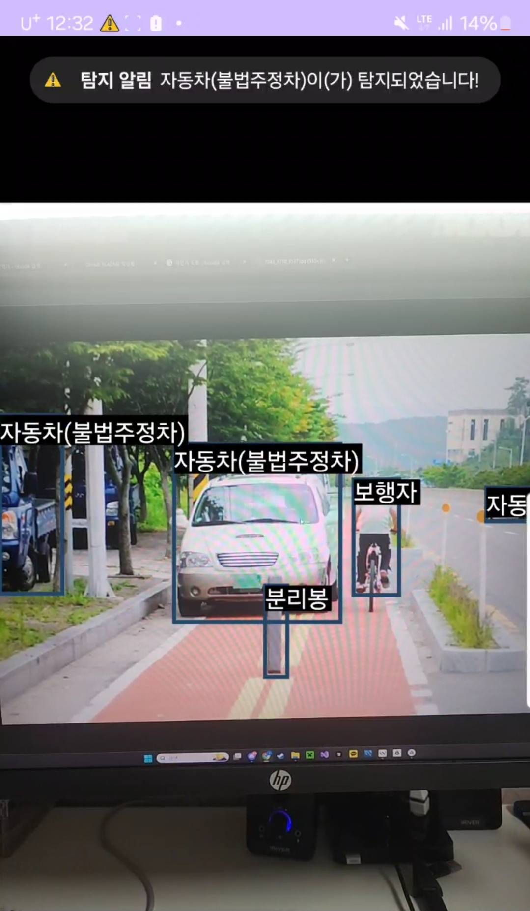

## YOLOv8 TFLite를 활용한 실시간 도로 환경 분석 안드로이드 앱



## 1. 프로젝트 개요

이 프로젝트는 스마트폰 카메라를 통해 실시간으로 도로 및 주변 환경을 분석하는 안드로이드 애플리케이션입니다. TensorFlow Lite 프레임워크와 최신 객체 탐지 모델인 YOLOv8을 사용하여 기기 내에서(On-device) 빠르고 효율적으로 AI 추론을 수행합니다.

도로의 파손 상태, 불법 주정차 차량, 보행자, 각종 시설물 등 다양한 객체를 실시간으로 탐지하여 사용자에게 시각적으로 보여줌으로써, 도로 유지보수, 교통 안전, 보행자 편의 증진 등 다양한 분야에 활용될 수 있습니다.

## 2. 주요 기능

- **실시간 객체 탐지**: 카메라 미리보기 화면에서 실시간으로 객체를 탐지하고 경계 상자(Bounding Box)와 라벨을 표시합니다.
- **On-Device AI**: 모든 AI 추론 과정이 서버 없이 스마트폰 내부에서 직접 처리되어 빠르고 데이터 보안에 강합니다.
- **다양한 객체 인식**: 도로 상태, 차량, 보행자, 시설물 등 총 26개의 클래스를 탐지하도록 학습된 커스텀 모델을 사용합니다. (상세 목록은 아래 '머신러닝 모델' 섹션 참조)

## 3. 기술 스택 및 주요 라이브러리

- **언어**: Java
- **플랫폼**: Android
- **AI 프레임워크**: TensorFlow Lite
- **아키텍처**: 기본적인 Android 앱 아키텍처 (Activity, View 등)

## 4. 머신러닝 모델

- **모델**: YOLOv8 (TensorFlow Lite 포맷 - `model.tflite`)
- **학습된 클래스 (`labels.txt`)**:
  - **도로 상태**: 포장도로, 데크, 보도블럭, 크랙, 결손, 들뜸, 침하, 보수구분
  - **교통 약자 및 수단**: 자동차(불법주정차), 보행자, 유모차, 전동킥보드, 자전거, 휠체어, 오토바이
  - **기타**: 동물, 볼라드, 분리봉, 난간, 표지판, 자전거보관대, 횡단보도, 신호등, 음수대, 매점, 화장실

## 5. 설치 및 빌드 방법

1.  이 저장소를 클론(Clone)합니다.
    ```bash
    git clone [저장소 URL]
    ```
2.  Android Studio를 사용하여 프로젝트를 엽니다.
3.  Gradle이 자동으로 프로젝트를 동기화하고 필요한 의존성을 다운로드합니다.
4.  빌드가 완료되면, 안드로이드 기기를 연결하여 앱을 실행합니다.

※ 별도의 API 키나 설정 없이 바로 빌드 및 실행이 가능합니다. Rename paths of your model and labels file in Constants.kt file
